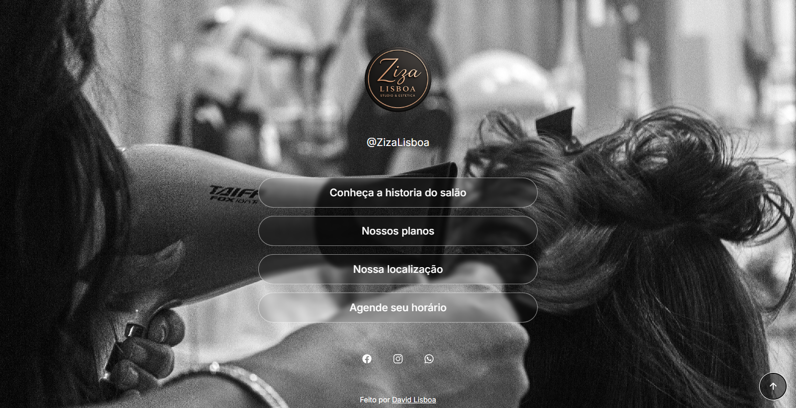
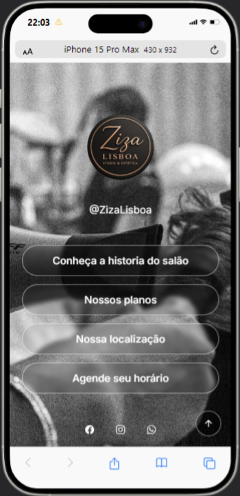

# 💇 Site para Salão de Beleza

## 📖 Sobre o projeto

Website desenvolvido para o salão Ziza Lisboa, com o objetivo de apresentar o estúdio, seus serviços, localização e facilitar o agendamento dos clientes.

Este foi um dos meus primeiros projetos práticos de desenvolvimento web.

## 🚀 Tecnologias

- HTML
- CSS
- Git
- Github
- Vercel

## ✨ Funcionalidades

- Página inicial
- Lista de serviços
- Informações de contato
- Localização
- Responsividade
- Navegação intuitiva

## 📷 Preview

### 🖥️ Versão Desktop

  

### 📱 Versão Mobile

  

## 🌐 Projeto online

[🔗 Acesse o projeto](https://zizalisboa.vercel.app)

## 👨‍💻 Autor

Desenvolvido por David Lisboa
